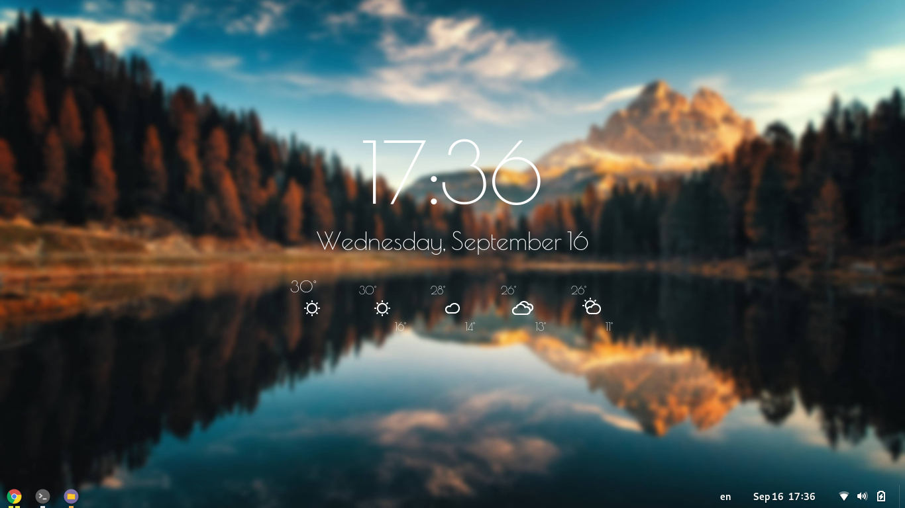

# Linux Post Installation Script 

This script is just a used to automatically install and configure software that I use on every Linux distribution. Usually it's best run right after a clean install of Linux. The included software is as follows:

#### Software used for functionality

* Zsh
* Neovim
* Tmux
* Google Chrome
* Visual Studio Code
* Conky
* Flameshot
* GNOME Dash-To-Panel Extension

#### Software used for visual aesthetics

* Oh-My-Zsh Agnoster theme
* Nord-Vim theme for Neovim
* Nord-Tmux theme for Tmux
* Conky-Vision theme for a modern desktop clock
* Poiret-One Font required by Conky-Vision
* Powerline Fonts required by oh-my-zsh
* Blurry wallpaper (helps with visibility of the Conky clock)
* Numix Circle Icons

## Visual Demo
#### Desktop look

### Note
This script will prompt you to update your system, as well as install the required tools. It is recommended to accept both prompts, but it is not required to do so. 

## Requirements
* Advanced Package Tool (APT)
* Client URL (cURL)
* Unzip
* Git
* GNOME Tweak Tool

## Usage
Clone this repository: `git clone https://github.com/kostoskistefan/linux-post-install.git`

Change to the cloned directory: `cd linux-post-install`

Run the script: `./install.sh`
